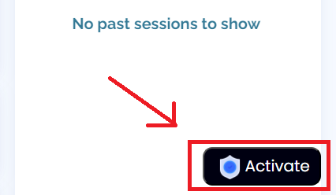

# 🔓 Bypass AZ Content Manager

**Note:** This tool is intended for educational purposes only. Please refrain from using it for any unethical or unauthorized activities, as such actions can have serious consequences. Videos provided already contain watermarks, which may lead to detection and potential repercussions. 

## Installation
1. **Prerequisites:** Ensure that you have the [TamperMonkey](https://chrome.google.com/webstore/detail/tampermonkey/dhdgffkkebhmkfjojejmpbldmpobfkfo) browser extension installed in your web browser.

2. **Installation:** Click the following link to install the script:
   

# How to Bypass! 🔓
  
1. **Activation:** You'll find a button in 'Bottom Right' corner, Locate and click the "Activate". 

  

  

2. **Start Sharing:** Select the window and commence sharing. You're all set! 

  

###  🎉Now, you can record or take screenshots without experiencing screen blackout.

  

3. **Deactivation:** When you've finished, click on "Deactivate" to return to normal mode. 

  

  
Utilize this tool for taking comprehensive notes and enhancing your offline learning experience. 

## Happy coding! 🚀

## Links
- GitHub Repository: [suraj-xd/az-video-bypass](https://github.com/suraj-xd/az-video-bypass)

